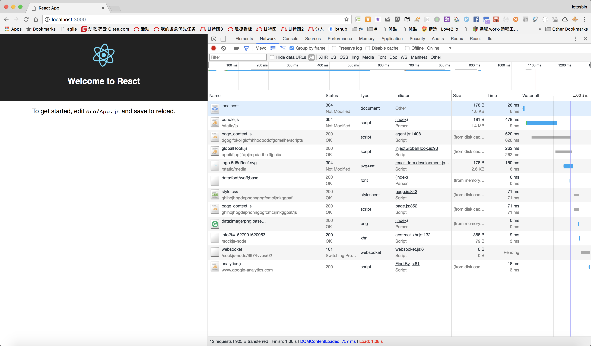
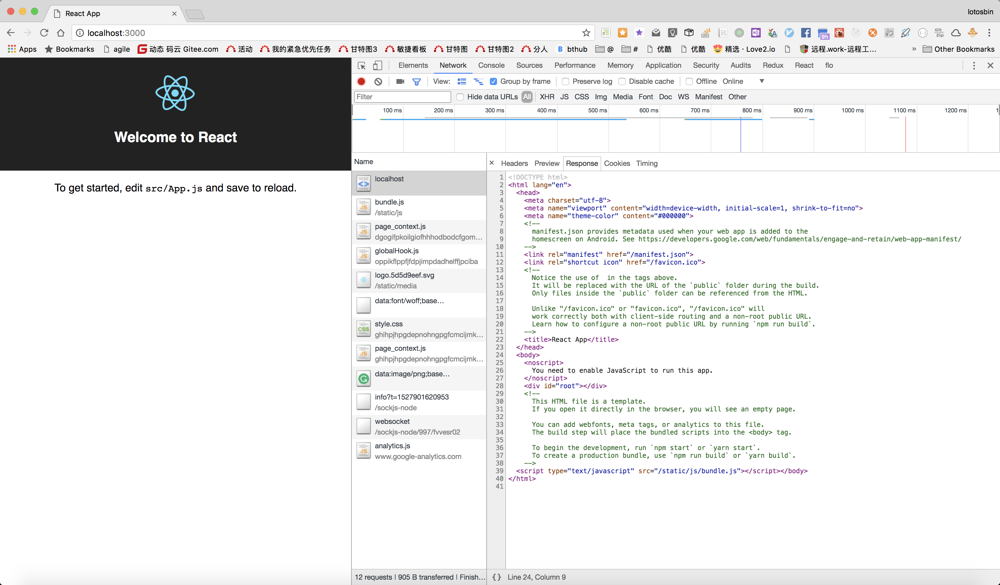

# simple react 
[contents](../README.md)
## prepare
 ```bash
 yarn global add create-react-app
 ```
- create react app
```
create-react-app my-app
yarn eject
```
- start
```
cd my-app
yarn
yarn start
open http://localhost:3000
```


## ssr
- preprea
```
mkdir ssr
```

```
yarn build
cp build/index.html ssr/
```

- create ssr.js
```
yarn add express
yarn add -D babel-cli

cd my-app
mkdir ssr
touch ssr/index.js
```
ssr/index.js
```

```
(optional): add start script to package.json
```json
{
    "scripts":{
        "start:server":"babel-node ssr/index.js",
    }
}
```
```
yarn start:server
```
[contents](../README.md)
